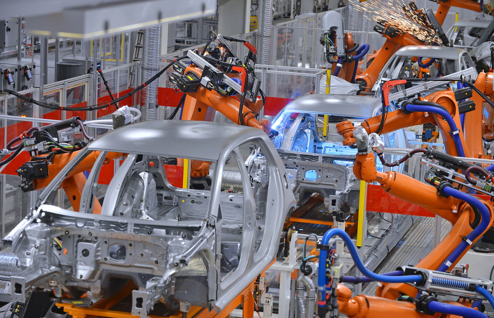
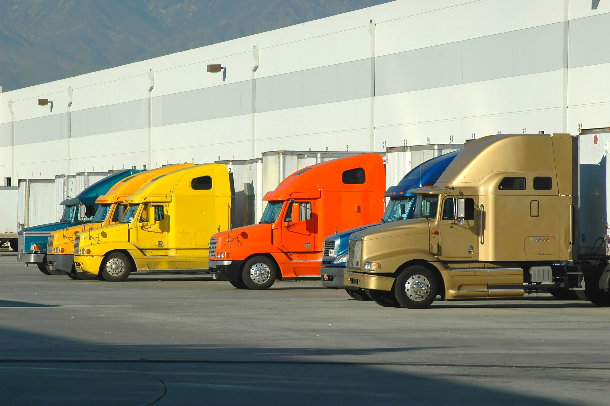

# This Shit is Hard: Inside the Chainguard Factory

*Jason Hall*

*May 27, 2025*

Over the last few years at Chainguard, we've built a scalable, efficient and secure factory, optimized to produce packages and images at a level of speed unmatched by any other Linux distribution. The efficiency of what we call the Chainguard Factory is what enables us to adhere to ourCVE remediation SLA](http://chainguard.dev/cve-sla)(7 days for critical CVEs and 14 days for high, medium, and low), and produce images that have demonstrably fewer CVEs than common alternatives.

Not to brag, but what Chainguard does is*hard*– bootstrapping an entirely new Linux distro, juggling thousands of packages and images, keeping them up to date and without avoidable CVEs, and doing so with a focus on security and reliability. Like most engineering efforts, it doesn't seem hard at first! As our CTO and co-founder Matt Moore likes to say, "we don't do this because it's easy, we do it because we*thought*it would be easy!" That’s why we're kicking off a blog series called “This Shit is Hard,” shedding light on what we’ve done behind the scenes and the lessons learned along the way. Welcome to our inaugural post!

Our ability to take on these challenges is only possible because of the infrastructure and automation we've built over the last three years, and the expertise we've gained from cumulative decades of multi-disciplinary engineering experience, from maintaining various Linux distros to large-scale production build systems.

Today, I'd like to swing open the doors of our Factory, and take you on a guided factory tour – an (over-)extended metaphor to show you a bit more about "how the Chainguard sausage" is made.

Don't forget your hardhats and reflective vests, and please remain clear of any large machinery!

## The Assembly Line

The central axis of the package release process, the beating heart of the Chainguard Factory, is the build system. This system is responsible for building thousands of different upstream projects, hundreds of times per day, securely, reliably, and cost-effectively. This assembly line has to be able to build and test open source projects of all shapes and sizes, using a gigantic array of build tools.

Over the past year, Engineering migrated from its previous build system based on GitHub Actions, to a fully custom-built system running on Kubernetes. This led to huge improvements in observability, scalability, and usability. Now we can unleash vast amounts of cloud resources to build, test, and validate every package that rolls off the line and out to users. We're only limited by what Finance will let us get away with! 🤣

A core tenet of Chainguard's approach to software supply chain security is that you must treat your build system like a production system – invest in observability, and design to harden it against compromise. Our own supply chain embodies that principle as well.

## The Humans

The Chainguard Factory is*made of people*, or at least designed and operated by them.

Chainguard employs dozens of specialist engineers around the world who built the automation that powers the Factory and manages anything the automation can't handle. They work on the assembly line every day to keep package updates moving smoothly. In a given week, you might find them debugging a new build failure with Kafka, applying patches to`gcc`or`curl`, applying build flags to harden builds, delivering a newly requested image for a new customer, or diving through upstream issues and discussions to understand breaking changes in a recent release.

The depth and breadth of experience and expertise on this team is truly astonishing. There's no codebase too gross, no build tool too archaic, no error message too vague, that they can't figure it out given enough time and caffeine.

## The Robots

But those soft, squishy humans can't do it alone. Like any modern real-world factory, human labor is heavily augmented with robotic automation, to supercharge efficiency and automate repetitive tasks.

Without these robots automating so much of the routine update process, maintaining a distro as fast-moving as Chainguard's would simply be infeasible.

The repetitive tasks for distro maintenance are things like:

- 

Updating package releases in response to upstream releases – i.e., when an open source project cuts a new release, the bots detect that and send a PR to build that latest release. This can often happen within minutes of the upstream release.

- 

This includes multiple upstream-supported version streams.

- 

The automation also moves packages out of the public Wolfi repo as they become EOL.

- 

Periodically scanning previously built packages and sending simple automated patches.

- 

The simplest case of this is automated Go dependency bumps.

- 

This also updates ourAdvisories](https://images.chainguard.dev/directory/image/jenkins/advisories)feeds to record when vulnerabilities were detected and remediated. This feed integrates withsupported scanners](https://www.chainguard.dev/scanners)to automatically silence CVE findings that we've proactively fixed.

- 

Scanning package updates for malware usingMalcontent](https://github.com/chainguard-dev/malcontent), and for new CVEs.

- 

Automatically merging PRs that have passed all required checks.

Those robots are also undergoing constant maintenance and upgrades by another team of dedicated engineers. They work closely with the humans augmented by the robots, to get feedback on what other sorts of repetitive tasks could be automated, or how to make the automation more reliable and useful.

## The AI

When things go wrong – and believe me, building this much software, a lot of things can go wrong – like many teams we've increasingly turned to AI to help us research and diagnose unfamiliar problems.

It's still early, but based on early experiments, we've found LLMs that are able to research and generate fix suggestions to be a real boon to our human fulfillment engineers.

While reimplementing our package build pipeline (the assembly line) over the last year, we've also hooked in error detection into the logs coming out of that pipeline. When an automated package update fails, the build logs are shipped off to our AI friends to identify, and research and summarize the error details, comparing it with previous attempted and successful fix suggestions for the package.

With that, the AI agent will suggest a fix directly in a GitHub comment. When these comments are useful, our engineers react to the comment with a 👍to give the AI a gentle head pat and encourage it to do more of that in the future.

## Quality Assurance

In addition to building vast amounts of open source software on a daily basis, we also constantly test that software to ensure we don't ship regressions as fast as we ship updates. This generally takes the form of package tests run every time a package is updated, and image integration tests, which run every time any package in an image is updated.

To validate a cloud native project for example, we may create a small local Kubernetes cluster using K3s, install a suite of related images using a Helm chart, watch to see that the installation was successful, and send some simple requests through the system before tearing it all down. This process must pass before any tags get published or synced to customers, dozens of times every day, for every image in the catalog.

In some more*interesting*cases, K3s might not be enough to validate the image is working as intended. For some projects that integrate deeply with external services, like public cloud providers, we had to get even more creative. To validate ourAWS EBS CSI Driver image](https://images.chainguard.dev/directory/image/aws-ebs-csi-driver/versions)and some others, we bring up a full, real EKS cluster, deploy our images to that cluster, run tests, and delete the cluster. These tests can take quite a bit longer to run, but the added peace of mind has been worth it. We expect to leverage these types of tests for more and more images going forward, especially where access to GPUs is needed.

## Distribution

The last step in the Chainguard Factory is distribution – the last mile between the Factory and your front door. If we're taking all that care to produce hardened, minimal container images, and then asking folks to come pick them up in a dimly lit parking lot, that's not a very secure supply chain!

Our image distribution infrastructure, like our build infrastructure, is optimized to leverage state-of-the-art security. Chainguard does not support indefinitely long-lived auth tokens, which on a long enough timeline are basically guaranteed to leak.

Instead, Chainguard prefers to useOpenID Connect](https://openid.net/developers/how-connect-works/)to ensure clients pull images using short-lived, narrowly-scoped, revocable auth tokens. Our end-user tooling like`chainctl`](https://edu.chainguard.dev/chainguard/chainctl-usage/getting-started-with-chainctl/)and its included credential helper ensure that we don't sacrifice usability for security.

## Summary

This has been a fairly high level overview of the Factory we've built at Chainguard to ensure the highest quality packages and images we believe it's possible to make, with lightning-fast updates, automated proactive patches to address CVEs, AI-assisted build failure diagnosis, and a massive test harness to test absolutely everything before it gets securely shipped out to our customers.

Want to learn more about our founders, and how we came up with the Chainguard Factory? Join ourChainguard Founders panel](https://events.chainguard.dev/e195371c-4ae4-4815-9a51-5c5301c8d687/)on June 4.

If this blog inspires you to learn even more about how our factory works, check out the talk above from Chainguard VP of Engineering Dustin Kirkland, where he goes into more detail about how our Factory works. And if you are interested in utilizing Chainguard’s products in your environment,reach out](https://www.chainguard.dev/contact)today.
Share