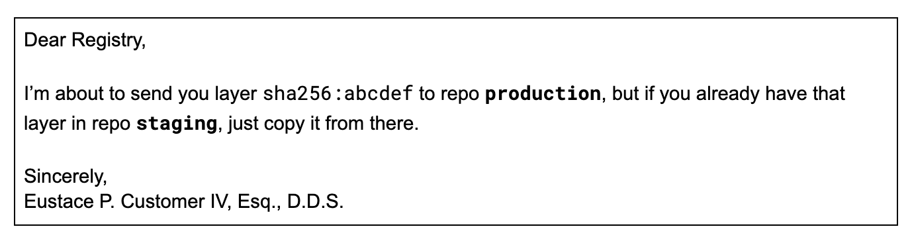

# GitHub Container Registry private repos sometimes… weren’t

*Jason Hall*

*January 23, 2023*

**TL;DR:**[GitHub Container Registry](https://docs.github.com/en/packages/working-with-a-github-packages-registry/working-with-the-container-registry)(GHCR) had an information leak bug, where the names of private repos were returned in HTTP response headers. It was reported and fixed. Now, this is the story all about how my life got flipped-turned upsid-- sorry, wrong story.*Keep reading anyway!*


As I sometimes do, one day I was fetching container images from GHCR and inspecting the HTTP traffic, and I noticed something weird in a response header:

```
`< X-Ms-Copy-Source: https://ghcr1production.blob.core.windows.net/ghcr1/repositories/REDACTED-ORG-NAME/REDACTED-REPO-NAME/uploads/REDACTED-UUID/data`
```

As I tried with more images, I found that sometimes lots of different organization and repo names would appear in these response headers. Repos that had nothing to do with the image I was pulling. I got curious and spot-checked a few, and noticed that some even seemed to correspond to*private*GHCR repos!


As I investigated further, I learned more details about how GHCR seems to have been implemented, and ultimately discovered an information leak bug in GHCR.


## Background: OCI Distribution API

Container image registries like DockerHub, ECR, GHCR, and many many others, all implement the same basic API: the Open Containers Initiative (OCI) Distribution API, the spec for which is [here](https://github.com/opencontainers/distribution-spec)if you’re curious, or are having trouble sleeping.


The basic gist is that OCI registries store container image metadata in “manifests”, and container image layer data in “blobs”. To ensure consistency and performance, manifests and blobs are referred to by the SHA256 hash of their contents, in a scheme called [content-addressable storage](https://en.wikipedia.org/wiki/Content-addressable_storage).


This means that the name of a blob is exactly the SHA256 of its contents. If you fetch a blob and want to make sure you got the expected contents, you simply have to take its SHA256 hash and check it against its name. Clients and registries both do these checks for you, to ensure they got the expected contents when images are pushed or pulled.


## Mounting Blobs

The OCI distribution API has some optimizations that leverage the content-addressable nature of blobs to avoid unnecessary data transfer when a layer is already present in the registry. If a layer’s SHA256 hash is already present, for example because it was uploaded by another user, then you don’t need to push it again. You can simply “mount” the layer from the other repository.


This behavior is useful because a lot of images share the same set of layers, especially base image layers. When your Dockerfile says FROM debian, the resulting image shares the layers found in the debian image, and it would be wasteful for everyone to upload it every time they pushed their images.


Usually this mounting behavior has to be explicitly requested, particularly in cases where layers are being copied or promoted between two repositories on the same registry:



In HTTP-ese, this is:

```
`POST /v2/production/blobs/uploads/?mount=sha256:abcdef&from=staging`
```

If the registry already has that hash in the**from**repository (and, if the user has access to that repository!), it will copy the layer, and respond with**201 Created**to let the client know that it doesn’t need to upload the whole contents.


This means that you may push debian’s layers the first time you push to your repository, but subsequent pushes can skip it. This optimization saves countless bytes per day from being needlessly sent across the internet.


In this case, it sounds like GHCR is implicitly mounting layers from*any*repository, whether or not the user asked for it in their request. This is probably a significant performance improvement, since any customer can avoid uploading a blob that*any other*customer has already uploaded. For common base images like debian, lots of users may have lots of images that share those same base layers, and they can all avoid pushing them to GHCR over and over.


Eagle-eyed readers may notice a possible [timing attack](https://en.wikipedia.org/wiki/Timing_attack): by observing whether a blob is mounted or uploaded, you can determine whether that blob exists anywhere in GHCR. However, this by itself isn’t necessarily that useful, since presumably if you know the hash of some blob you probably also have its actual contents already. It’s simply not feasible to request all 2^256 unique SHA256 values and see if anything matches, though you’re welcome to try if you’ve got the time.


But that’s not all! Why does the blob response contain metadata about some other repository where it was previously uploaded?


## Copying Objects in Azure Blob Storage

While investigating this behavior, I learned that GHCR is apparently backed by [Azure Blob Storage](https://learn.microsoft.com/en-us/azure/storage/blobs/)(ABS) – you can see**.blob.core.windows.net**in the URL above.

When you copy an object in ABS, it retains some metadata about the original blob’s location for some reason. And this information is sent in response headers when you fetch the new object.


Normally this wouldn’t be a huge deal; if you’re using ABS directly, and copying objects inside your own bucket, you can only really leak information about objects you already own. Big whoop.


The problem arises when you store multiple tenants’ worth of data in one bucket, and serve it from a single user-facing frontend service. This seems to be how GHCR is implemented, as a single ABS bucket, namedghcr1production, with every GHCR repo’s blobs stored together.


This also explains how cross-repo mounting was done so easily. All GHCR customers’ blobs are in one big bucket, so mounting is as easy as checking if that object already exists in the big shared bucket.


The problem is, when you copy that object, you also copy the metadata about where it came from. And where did*that*come from?


## Uploading Blobs

When you upload a new blob to ghcr.io/user1/my-repo, GHCR first checks if that blob already exists in its huge multi-tenant storage bucket. If it doesn’t, the registry initiates an upload. It does this by responding**202 Accepted**, instead of**201 Created**, with a Location response header telling the client where to send data. This URL contains a randomly generated UUID identifying this particular upload.


In the case of GHCR, this upload URL also seems to include the GHCR repo name, e.g., user1/my-repo.


When the client gets this 202 Accepted response, it can start PATCHing data in chunks into the upload location. When it’s done, it sends a PUT with any final data, and the SHA256 of the contents it sent, to finalize the upload.


To finalize an upload, GHCR tells Azure Blob Storage to copy that blob to its final location in the big multi-tenant bucket, so that future requests to upload that layer can be skipped.

The problem is, copying that object also copied metadata about the original upload location, including the original repository, user1/my-repo. This was the case even if my-repo is a private GHCR repository. 💥


NB: The copied metadata was not limited to the source URL. It also contained – and contains to this day! – the date and time the initial copy was initiated and completed, and its total size.

```
`< X-Ms-Copy-Completion-Time: Wed, 11 Jan 2023 03:39:36 GMT< X-Ms-Copy-Id: a2657ab0-a85a-434a-ab4f-8f59df1c3b69< X-Ms-Copy-Progress: 10876737/10876737< X-Ms-Copy-Status: success< X-Ms-Creation-Time: Wed, 11 Jan 2023 03:39:36 GMT`
```

These aren’t terribly interesting, but maybe I’m just not being creative enough.


## Lessons Learned

Implementing a multi-tenant service with a single shared storage backend can be*tricky*.


- 

This is especially true if some data in the shared backend is meant to be private.

- 

Metadata can leak information, and can even leak out to end users.


In short, “be careful out there”.


## Impact

This behavior leaked the*existence*of private GHCR repos, and their names. The*contents*of private image layers were not leaked as far as we can tell, since in order to find the private layers, you’d have had to already know the layers’ hash.


Still, leaking the existence and names of private repos can give attackers useful information about where to look for other secret goodies, and can help craft more believable phishing attacks.


## Timeline

- 

March 28, 2022: Reported the issue via https://bounty.github.com/

- 

March 31, 2022: Report confirmed, working on a fix.

- 

May 10, 2022: We stopped observing the leaky behavior.

- 

May 13, 2022: Report was marked as resolved.

- 

Jan 18, 2023: Report closed, disclosure cleared.

- 

Today: you are reading this text.


For reporting the bug, GitHub awarded a $617 reward. The reward was donated to [Women Have Options](https://abortionfunds.org/fund/women-have-options/), an abortion access fund in Ohio, which GitHub matched. Chainguard contributed another $1,234, bringing the total contribution to $2,468.
Share