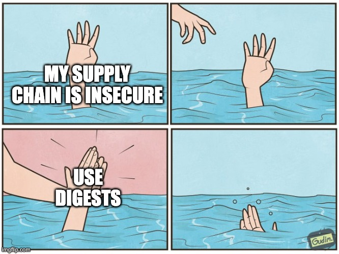

# Chainguard&#x27;s image tagging philosophy: enabling high velocity updates (pt. 3 of 3)

*Jason Hall*

*November 17, 2023*

***Part 3 of 3 in the series. In****Part 1**](https://www.chainguard.dev/unchained/chainguards-image-tagging-philosophy-enabling-high-velocity-updates-pt-1-of-3)**, we explored tagging philosophy from a high level and tag updates. In****Part 2**](https://www.chainguard.dev/unchained/chainguards-image-tagging-philosophy-enabling-high-velocity-updates-pt-2-of-3)**, we covered content-addressed tagging, comparison with Git Tags, and mutability considerations.**


## **How Chainguard Deploys by Digest**


Because it's critically important to know exactly what is running in your environment, we believe you should deploy by digest. This leaves no opportunity for a malicious or accidental tag push to sneak its way in and immediately roll out to production.


Speaking of deployment, this also removes the need to value the different Kubernetes`imagePullPolicy`](https://kubernetes.io/docs/concepts/containers/images/#image-pull-policy)values, which control whether to check if a tag changed and pull those changes – there are never any tag changes, so`imagePullPolicy:Always`is the same as`IfNotPresent`.


But digests are made for computers, not humans. The fundamental problem with digests is that they don't carry semantic information that humans need to understand what the image "is". The solution is automation.


At Chainguard we practice what we preach and deploy by digest, with image references by digest in our monorepo's source tree. As an illustration, here's a sample Deployment manifest:

```
`apiVersion: v1
type: Deployment:
metadata:
 name: kafka
spec:
 template:
 spec:
 containers:
 - name: kafka
 image: cgr.dev/chainguard-internal/kafka:1.2.3@sha256:abcdefabcdefabcdefabcdefabcdefabcdefabcd`
```

Our automation, which we call [digesta-bot](https://github.com/chainguard-dev/actions/tree/main/digesta-bot), scans the codebase for strings that look like image references in this form, specifying a tag and digest. When one is found, digesta-bot looks up the current digest of the tag, updates the file and opens a pull request, where the normal battery of CI tests ensure the update is safe.


The bot just does string matching, so it works equally well on YAML (Kubernetes manifests and GitHub Actions workflows), Dockerfiles, shell scripts, and more.


This means that our source always refers to image artifacts by digest, but they can still follow a tag's updates. Changes aren't merged to the monorepo without passing tests, and any failures can be isolated and changed in the pull request. If we discover an image update is bad for whatever reason after the pull request is merged (e.g., it fails in staging), we can revert the digest update in question and deploy the old digest for the tag. The digest will be updated on the next digesta-bot run, or we can manually babysit it to production if needed.


This also means that digests are updated on a scheduled basis, and pass tests, and are reviewed and approved by a human before they reach production. This necessarily takes time, and it means that it can be days or longer for us to roll out an upstream update. That's fine! Depending on your organization it can take much longer, and*that's fine too!*The most important thing is that updates are automated and happen as often as possible for your organization.


It's Chainguard's responsibility to provide image updates as fast as possible, so that you can pick them up as fast as you can. If it took us two weeks to get an update released, that means it could never take less than two weeks for you to release it.


## Digests Aren't Enough

Using digests wherever possible, and using automation to update those digests, are an important part of making your supply chain secure, but they're not the whole story.


Digests describe the complete state of a container image, immutably, provably, forever. That's good; you want to be able to have a provable shorthand for the state of a thing running in production, but you also need more.



There are other questions you'll need to answer about your images, and Chainguard provides other tools and APIs to help answer them. Questions like:

### What's in this image? What version of`bash`is in`go:1.21.1-r2`?

Chainguard provides signed SBOM attestations for all our images, which list all the packages and versions of all the software in the image.

### When should I update the digest? I really want to consume a tag.

Like most registry implementations, Chainguard emits webhook events when images are pushed, including when tags are updated. You can subscribe to these messages and take action, or periodically check for tag updates, whichever matches your team's workflow best.You can get the current digest of a tag using [standard APIs](https://github.com/opencontainers/distribution-spec/blob/main/spec.md#checking-if-content-exists-in-the-registry), but those APIs only point to the current digest of a given tag. To let you look back in time, Chainguard provides a [Tag History API](https://edu.chainguard.dev/chainguard/chainguard-images/using-the-tag-history-api/), which shows the history of a tag over time, with an entry for each time the tag was updated, when, and what digest it pointed to.You can think of it like a git`log`for your image stream.

### What changed in this image since the last update?

There aren't standard APIs to tell what's changed between two images. There are somewhat hacky ways to compare the [contents of two images' filesystems](https://github.com/google/go-containerregistry/blob/main/cmd/crane/recipes.md#diff-filesystem-contents), which can be useful in general, but might not give you enough information to make an informed decision about whether an update is "safe" or "worth it". Since we provide SBOMs, you can look at the SBOMs of two images, and compare the package lists, which is a start.To make this easier, Chainguard provides`chainctl image diff`](https://edu.chainguard.dev/chainguard/chainctl/chainctl-docs/chainctl_images_diff/), which collates and compares the packages in two images' SBOMs, so you can see which packages are updated or added or removed between two points in time.You can think of it like`git diff`for your image stream.Using the diff CLI, you can determine – even help automate determining – whether an image update contains a consequential update to any of its packages (e.g., a breaking major version update to`bash`), and whether the value of that change is acceptable (e.g., to fix a vuln). By giving you both the "cost" and "benefit" sides of the equation, the hope is that this API helps guide decisions about update risk, without making those decisions for you.

### What if I can't deploy every update as fast as Chainguard produces them?

I'd be surprised if you could! We couldn't do it ourselves, and we don't even try. We use automation and frequent releases to stay on top of updates. If we didn't release as frequently, we'd rely on the features described above to give us an idea of what's waiting for us in the undeployed releases – what package updates (the potential risk) and what vulnerability fixes (the potential reward).The hope is that we can likewise provide other teams the information necessary to make informed decisions, even automatically at scale.

## Looking Ahead

We're not done improving this experience for our users. Software updates are complex and necessarily constitute risk, but software updates also represent value when they fix vulnerabilities and provide other improvements. Being able to provably identify the unique contents of an image, and see its history, and understand the differences between two images, are critical components in making the latest updates maximally valuable, while minimizing risk.We welcome any input or ideas on how we can improve this experience, so please feel free to [contact us](https://www.chainguard.dev/contact).
Share