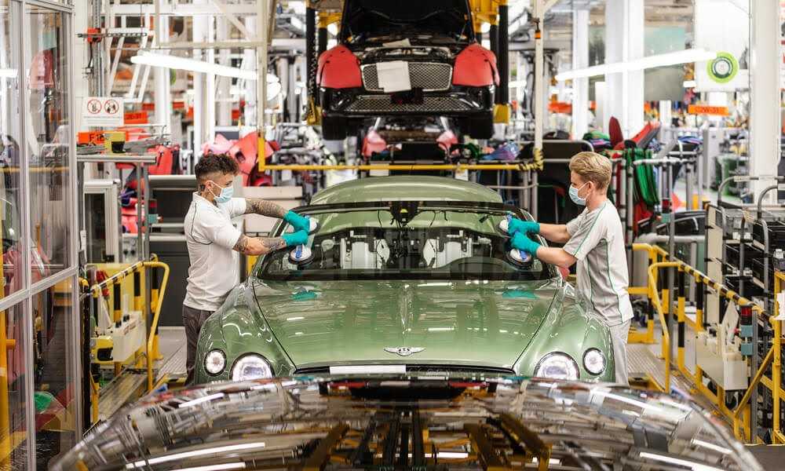
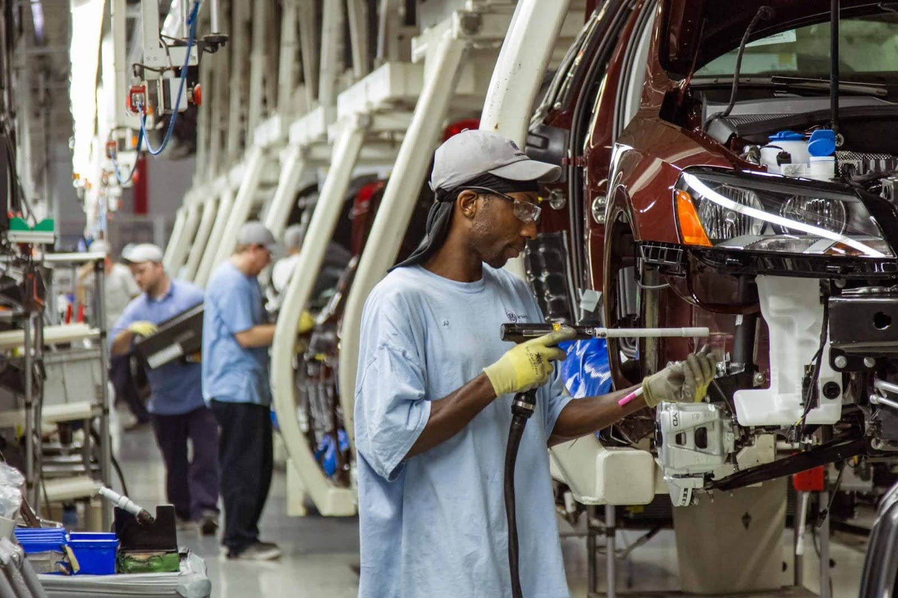
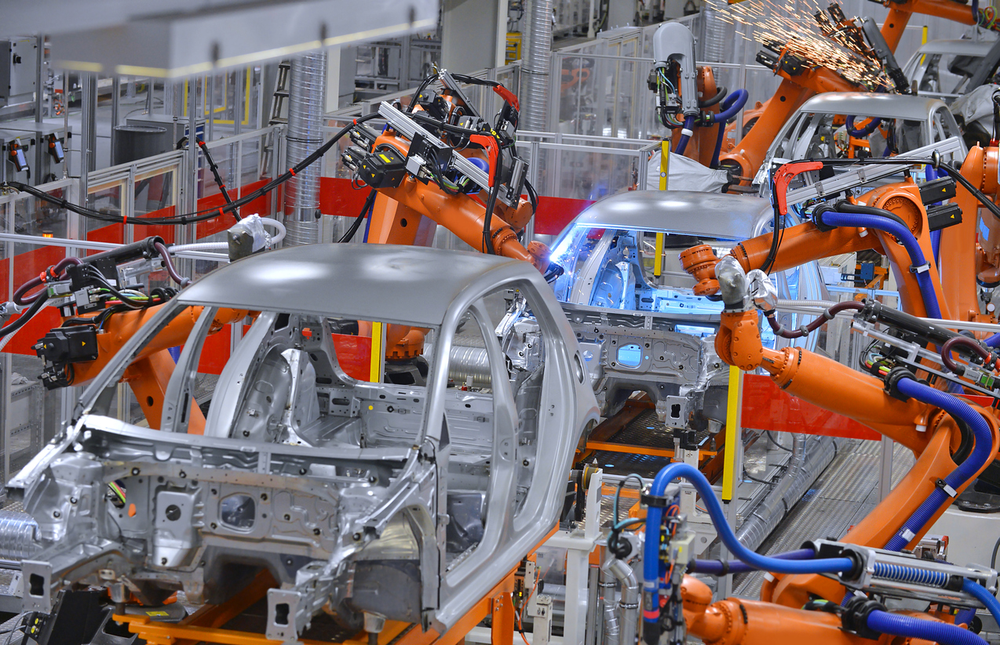
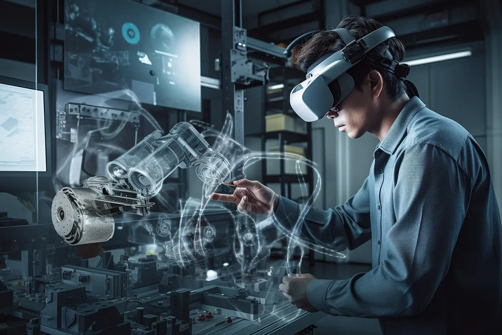
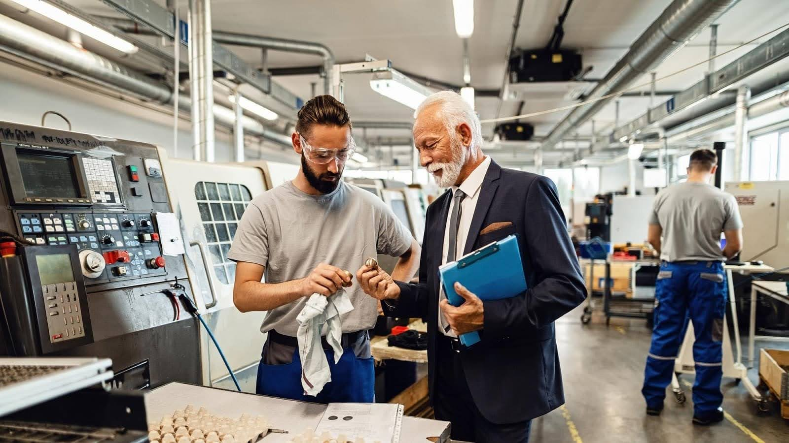
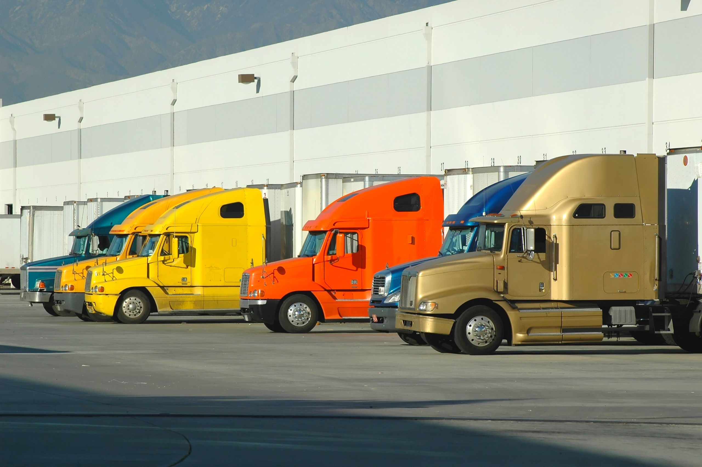

*Original URL: https://www.chainguard.dev/unchained/this-shit-is-hard-inside-the-chainguard-factory*

---

# This Shit is Hard: Inside the Chainguard Factory
Jason Hall, Principal Software
 Engineer May 27, 2025

 Over the last few years at Chainguard, we've built a
 scalable, efficient and secure factory, optimized to produce packages and images at
 a level of speed unmatched by any other Linux distribution. The efficiency of what
 we call the Chainguard Factory is what enables us to adhere to our [CVE remediation SLA](http://chainguard.dev/cve-sla) (7 days for critical
 CVEs and 14 days for high, medium, and low), and produce images that have
 demonstrably fewer CVEs than common alternatives.

 Not to brag, but what Chainguard does is *hard*–
 bootstrapping an entirely new Linux distro, juggling thousands of packages and
 images, keeping them up to date and without avoidable CVEs, and doing so with a
 focus on security and reliability. Like most engineering efforts, it doesn't
 seem hard at first! As our CTO and co-founder Matt Moore likes to say, "we
 don't do this because it's easy, we do it because we *thought *it
 would be easy!" That’s why we're kicking off a blog series called “This
 Shit is Hard,” shedding light on what we’ve done behind the scenes and the lessons
 learned along the way. Welcome to our inaugural post!

 Our ability to take on these challenges is only possible
 because of the infrastructure and automation we've built over the last three
 years, and the expertise we've gained from cumulative decades of
 multi-disciplinary engineering experience, from maintaining various Linux distros to
 large-scale production build systems.

 Today, I'd like to swing open the doors of our Factory,
 and take you on a guided factory tour – an (over-) extended metaphor to show you a
 bit more about "how the Chainguard sausage" is made.

 Don't forget your hardhats and reflective vests, and
 please remain clear of any large machinery!

## The Assembly Line

 The central axis of the package release process, the beating
 heart of the Chainguard Factory, is the build system. This system is responsible for
 building thousands of different upstream projects, hundreds of times per day,
 securely, reliably, and cost-effectively. This assembly line has to be able to build
 and test open source projects of all shapes and sizes, using a gigantic array of
 build tools.

 Over the past year, Engineering migrated from its previous
 build system based on GitHub Actions, to a fully custom-built system running on
 Kubernetes. This led to huge improvements in observability, scalability, and
 usability. Now we can unleash vast amounts of cloud resources to build, test, and
 validate every package that rolls off the line and out to users. We're only
 limited by what Finance will let us get away with! 🤣

 A core tenet of Chainguard's approach to software supply
 chain security is that you must treat your build system like a production system –
 invest in observability, and design to harden it against compromise. Our own supply
 chain embodies that principle as well.

## The Humans

 The Chainguard Factory is *made of people*, or at least
 designed and operated by them.

 Chainguard employs dozens of specialist engineers around the
 world who built the automation that powers the Factory and manages anything the
 automation can't handle. They work on the assembly line every day to keep
 package updates moving smoothly. In a given week, you might find them debugging a
 new build failure with Kafka, applying patches to`gcc`or`curl`,
 applying build flags to harden builds, delivering a newly requested image for a new
 customer, or diving through upstream issues and discussions to understand breaking
 changes in a recent release.

 The depth and breadth of experience and expertise on this team
 is truly astonishing. There's no codebase too gross, no build tool too archaic,
 no error message too vague, that they can't figure it out given enough time and
 caffeine.

## The Robots

 But those soft, squishy humans can't do it alone. Like
 any modern real-world factory, human labor is heavily augmented with robotic
 automation, to supercharge efficiency and automate repetitive tasks.

 Without these robots automating so much of the routine update
 process, maintaining a distro as fast-moving as Chainguard's would simply be
 infeasible.

 The repetitive tasks for distro maintenance are things like:

Updating package releases in response to upstream
 releases – i. e., when an open source project cuts a new release, the bots
 detect that and send a PR to build that latest release. This can often
 happen within minutes of the upstream release.
This includes multiple upstream-supported
 version streams. The automation also moves packages out of the
 public Wolfi repo as they become EOL.

 Periodically scanning previously built packages and
 sending simple automated patches.

The simplest case of this is automated Go
 dependency bumps. This also updates our [Advisories](https://images.chainguard.dev/directory/image/jenkins/advisories) feeds to record when vulnerabilities were detected and remediated.
 This feed integrates with [supported scanners](https://www.chainguard.dev/scanners) to
 automatically silence CVE findings that we've proactively
 fixed.

 Scanning package updates for malware using [Malcontent](https://github.com/chainguard-dev/malcontent), and for new CVEs.

 Automatically merging PRs that have passed all
 required checks.

 Those robots are also undergoing constant maintenance and
 upgrades by another team of dedicated engineers. They work closely with the humans
 augmented by the robots, to get feedback on what other sorts of repetitive tasks
 could be automated, or how to make the automation more reliable and useful.

## The AI

 When things go wrong – and believe me, building this much
 software, a lot of things can go wrong – like many teams we've increasingly
 turned to AI to help us research and diagnose unfamiliar problems.

 It's still early, but based on early experiments,
 we've found LLMs that are able to research and generate fix suggestions to be a
 real boon to our human fulfillment engineers.

 While reimplementing our package build pipeline (the assembly
 line) over the last year, we've also hooked in error detection into the logs
 coming out of that pipeline. When an automated package update fails, the build logs
 are shipped off to our AI friends to identify, and research and summarize the error
 details, comparing it with previous attempted and successful fix suggestions for the
 package.

 With that, the AI agent will suggest a fix directly in a
 GitHub comment. When these comments are useful, our engineers react to the comment
 with a 👍to give the AI a gentle head pat and encourage it to do more of that in the
 future.

## Quality Assurance

 In addition to building vast amounts of open source software
 on a daily basis, we also constantly test that software to ensure we don't ship
 regressions as fast as we ship updates. This generally takes the form of package
 tests run every time a package is updated, and image integration tests, which run
 every time any package in an image is updated.

 To validate a cloud native project for example, we may create
 a small local Kubernetes cluster using K3s, install a suite of related images using
 a Helm chart, watch to see that the installation was successful, and send some
 simple requests through the system before tearing it all down. This process must
 pass before any tags get published or synced to customers, dozens of times every
 day, for every image in the catalog.

 In some more *interesting *cases, K3s might not be enough
 to validate the image is working as intended. For some projects that integrate
 deeply with external services, like public cloud providers, we had to get even more
 creative. To validate our [AWS EBS CSI Driver image](https://images.chainguard.dev/directory/image/aws-ebs-csi-driver/versions) and some others, we bring up a full, real EKS cluster, deploy our images to that
 cluster, run tests, and delete the cluster. These tests can take quite a bit longer
 to run, but the added peace of mind has been worth it. We expect to leverage these
 types of tests for more and more images going forward, especially where access to
 GPUs is needed.

## Distribution

 The last step in the Chainguard Factory is distribution – the
 last mile between the Factory and your front door. If we're taking all that
 care to produce hardened, minimal container images, and then asking folks to come
 pick them up in a dimly lit parking lot, that's not a very secure supply chain!

 Our image distribution infrastructure, like our build
 infrastructure, is optimized to leverage state-of-the-art security. Chainguard does
 not support indefinitely long-lived auth tokens, which on a long enough timeline are
 basically guaranteed to leak.

 Instead, Chainguard prefers to use [OpenID Connect](https://openid.net/developers/how-connect-works/) to ensure clients pull
 images using short-lived, narrowly-scoped, revocable auth tokens. Our end-user
 tooling like [`chainctl`](https://edu.chainguard.dev/chainguard/chainctl-usage/getting-started-with-chainctl/) and its included credential helper ensure that we don't sacrifice usability for
 security.

## Summary

 This has been a fairly high level overview of the Factory
 we've built at Chainguard to ensure the highest quality packages and images we
 believe it's possible to make, with lightning-fast updates, automated proactive
 patches to address CVEs, AI-assisted build failure diagnosis, and a massive test
 harness to test absolutely everything before it gets securely shipped out to our
 customers.

 Want to learn more about our founders, and how we came up with
 the Chainguard Factory? Join our [Chainguard Founders panel](https://events.chainguard.dev/e195371c-4ae4-4815-9a51-5c5301c8d687/) on June 4.

 If this blog inspires you to learn even more about how our
 factory works, check out the talk above from Chainguard VP of Engineering Dustin
 Kirkland, where he goes into more detail about how our Factory works. And if you are
 interested in utilizing Chainguard’s products in your environment, [reach out](https://www.chainguard.dev/contact) today.
