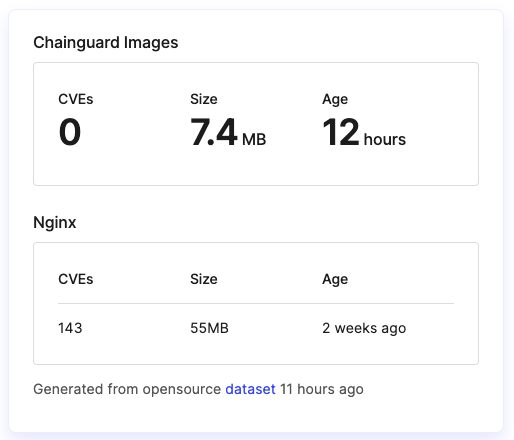

*Original URL: https://www.chainguard.dev/unchained/building-chainguards-container-image-registry*

---

# Building Chainguard&#x27;s container image registry

*Jason Hall*

*May 23, 2023*

Chainguard Images form the base layer of our software supply chain security platform, and delivering this foundational infrastructure in as secure of a manner as possible is, well, critical to everything we do. We’ve made a few changes to the way we host and distribute our Images over the last year to increase security, give ourselves more control over the distribution, and most importantly to keep our costs under control. This post explains why we decided to build our own registry, why it’s platformed on [Cloudflare R2](https://www.cloudflare.com/products/r2/) and how we’re using it to deliver secure base images.

## **The decision**

Since the launch of [Chainguard Images](https://www.chainguard.dev/unchained/scaling-chainguard-images-with-a-growing-catalog-and-proactive-security-updates), we've been distributing the Images we produce using a thin [wrapper](http://github.com/cha inguard-dev/registry-redirect) in front of GitHub's Container Registry. This was a pragmatic choice that let us focus our energy on the tools and systems we use to build the images and gave us the flexibility to change how we distributed the images later. Over time, as we expected, relying on an external registry host meant delivering certain features was out of our control.

As we scaled up the Chainguard Images product, we knew it was time to come back and take a fresh look at how we distributed our Images, and we decided to build our own registry implementation, capitalizing on our engineering team's years of experience operating hyperscale registries.

**The result is that our registry is the first passwordless container registry, designed from the ground up with a focus on security, efficiency, flexibility and cost-effectiveness.**

We thought this would be a good opportunity to offer a peek behind the scenes at how our registry implementation works, and the decisions we made along the way.

## **Secure by design**

Registries hold valuable data, and they deserve more than a username and a password to protect it. Building on the state of the art for container image registries, the Chainguard Registry relies solely on short-lived OIDC credentials to push and pull.

We use GitHub Actions to push our Chainguard Images to the registry. Using OIDC we were able to configure the public Chainguard registry repository so that only our GitHub Actions workflow identity is authorized to push to it. This means that no Chainguard employee has direct access to push to the registry. If they want to make a change, it has to be done through the GitHub repo, where they need approval from another teammate and where there's an immutable public audit trail in the repo's commit history, and build logs in the Actions workflow history. This process is in line with [SLSA build level [3](https://slsa.dev/spec/v1.0/levels#build-l3-hardened-builds)- the highest level.

When pulling images, customers can authenticate with a credential helper built into our chainctl CLI, which again relies on OIDC to authenticate the user. Using the credential helper, there are no long-lived tokens stored on the user's computer whatsoever. Both chainctl and the credential helper are aware of common OIDC-enabled execution environments, like GitHub Actions, and will use those credentials if they're available. This means customers can also limit the ability to pull an image to only the expected environments. This is all achieved without a long-lived token, relying only on OIDC for authentication. See our docs for [uthenticating with GitHub [Actions](https://edu.chainguard.dev/chainguard/chainguard-images/registry/authenticating/#authenticating-with-github-actions) for more information. Right now, existing Chainguard Images customers cannot push directly to the registry. The Image registry is used to host Images created and managed by Chainguard.

The registry also supports longer-lived authentication options for environments that don't support OIDC, using ull [tokens](https://edu.chainguard.dev/chainguard/chainguard-images/registry/authenticating/#authenticating-with-a-pull-token), which live longer than the temporary OIDC tokens, and can be revoked on-demand.

## **Cloud Events**

Like the rest of the [Chainguard Enforce](https://edu.chainguard.dev/chainguard/chainguard-enforce/) platform, the Chainguard Registry sends [CloudEvents](https://cloudevents.io/) when noteworthy things happen in your group. This means Chainguard Images customers can create a subscription and receive events for both image [pushes](https://edu.chainguard.dev/chainguard/chainguard-enforce/reference/events/#service-registry---push) and [pulls](https://edu.chainguard.dev/chainguard/chainguard-enforce/reference/events/#service-registry---pull), including when the push or pull fails. The event payloads include a JWT signed by the Enforce OIDC [issuer](https://edu.chainguard.dev/chainguard/chainguard-enforce/reference/events/#authorization-header) to ensure it was authentic and sent by Chainguard.

These events can be used to trigger base image updates, run your own vulnerability scans or acceptance tests, copy pushed images into your own internal mirror, or just audit what users and systems are pulling images and from where.

## **Built for sustainability**

The 800-pound gorilla in the room of container image registry operators is**egress fees**: charges from cloud providers for moving or transferring data from the cloud storage where it was uploaded. Image registries move a lot of bits to a lot of users all over the world, and moving those bits can become very expensive, very quickly. In fact, just paying to move image bits is often the main cost of operating an image registry.

For example, Docker's official [ nginx [image](https://hub.docker.com/_/nginx) has been pulled over a billion times, about 31 million times in the last week alone. The image is about 55 megabytes, so that's 1.7 PB of egress. At S3's standard egress pricing of $0.05/GB, that's**$85,000**, to serve just the nginx image, for just one week. Now, not all of those "pulls" may represent actual blob fetches, and Docker may not be paying the standard list price for egress for each of those bytes – hopefully they're not! – but regardless, it's not cheap.

This cost is usually passed on in some form to users, typically in one of a few ways:

- The image producer pays to host and distribute their images, usually paid to Cloud hosting providers (GCR, ECR, ACR).

- The image producer doesn't pay to host images, but the registry host has to impose rate limits to avoid paying too much to their own Cloud hosting provider, and is incentivized to aggressively upsell customers to paid plans (Dockerhub, GHCR, Quay).

- Some combination of the two.

This has been a reality of container image hosting providers forever. But we don't think it has to be.

Our mission with Chainguard Images is to provide high quality, trustworthy images to everybody, which means we must do it sustainably and economically. We can't be spending $85k/week just distributing our [ecure nginx [image](https://github.com/chainguard-images/images/tree/main/images/nginx), we'd rather invest that in the image itself. For example, by making it 85% smaller with fewer CVEs, as a complete hypothetical ;).

We built our registry implementation using [Cloudflare R2](https://www.cloudflare.com/products/r2/) to distribute image blobs to users. R2 provides zero egress-fee hosting of objects, and a fast global distribution network that's trusted by tons of companies large and small. We believe R2 fundamentally changes the story for image hosting providers, and makes this a sustainable model for hosting free public images without imposing onerous costs or rate limits.

Building our own container registry gives us the flexibility to provide the best security for our users, build a sustainable foundation for our ongoing product growth and sets the stage for even more features we're excited to share with users in the near future.

You can [try](https://console.enforce.dev/auth/login) our Chainguard Images today to see for yourself how we're working to improve the container image landscape with a secure-by-default design.

If your interested in seeing how we approach building our Images and what makes them more secure than the alternative options,**join Chainguard CEO Dan Lorenc on May 23rd at 3 PM ET / 12 PM PT**for a live demo session on building Chainguard Images. Register [ere](https://www.crowdcast.io/c/live-image-may23)*(if you can't attend live a recording will be sent to you if you register).*
Share