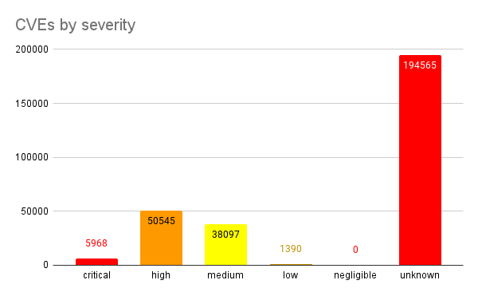
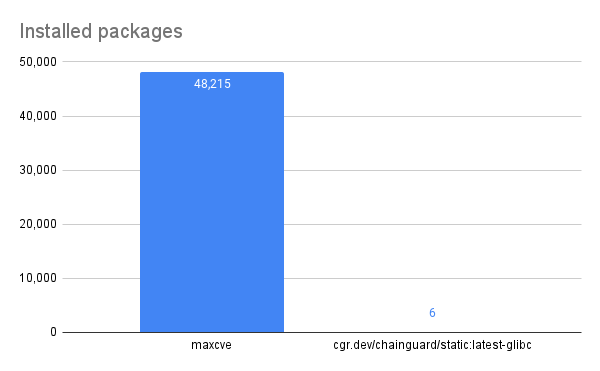

*Original URL: https://www.chainguard.dev/unchained/the-story-of-the-most-vulnerable-chainguard-image*

---

# The story
 of the most vulnerable Chainguard Image
Jason Hall, Serious Principal Software
 Engineer April 1, 2024

 At Chainguard we take pride in producing hundreds of minimal, up-to-date,
 secure container images every day, with many fewer known vulnerabilities than upstream equivalents.

 Customers often ask us how we do it. I can tell you it's not easy.
 Anything beyond that is a highly guarded trade secret of course. Or it was … until today.

 When we started building secure container images, we were faced with a
 conundrum. Vulnerabilities are everywhere, they can't just be swept under the rug. But then a
 clever engineer (who shall remain nameless, but it was me) had an idea: what if we just …*did *sweep them under a rug?

 What if we secured our images by simply moving all those vulnerabilities into
 one unspeakably insecure image, where it couldn't do any harm? 🤔

 For this Chainguard Image, we took inspiration from Mr. Burns (see below).

## Software only an attacker could love

 So that's what we did. And today, I'm excited to release that image
 onto an unsuspecting public.*That's you!*

 You can scan this image yourself —*if you dare!*You can use Grype, or
 any other [scanner that supports](https://www.chainguard.dev/scanners?utm_source=blog&utm_medium=website&utm_campaign=FY25-EC-Blog_sourced) Chainguard Images:

```
$ grype ghcr. io/chainguard-dev/maxcve/maxcve 1> /dev/null
 ├── ✔ Packages [48,215 packages]
 └── ✔ Executables [0 executables]
 ✔ Scanned for vulnerabilities [290565 vulnerability matches]
 ├── by severity: 5968 critical, 50545 high, 38097 medium, 1390 low, 0 negligible (194565 unknown)
 └── by status: 282221 fixed, 8344 not-fixed, 0 ignored

```

 This sacrificial insecure image contains almost** 300,000** vulnerabilities according to Grype. It contains all the
 known vulnerabilities we've managed to keep out of our real [Chainguard Images](https://www.chainguard.dev/chainguard-images?utm_source=blog&utm_medium=website&utm_campaign=FY25-EC-Blog_sourced).



 Zero negligible vulnerabilities,
 nice!



 Real minimal base image for scale

 Before you attempt to reproduce these results, be warned that scanning the
 image with Grype takes about eight minutes.

 We didn't even have to sacrifice our commitment to producing minimal
 images to accomplish this. There is no reason those hundreds of thousands of vulnerabilities have to
 balloon your image to gargantuan size. This image is a svelte 339 KB, making it the smallest image we
 produce.

 That’s about one vulnerability detected for every* 1.19 bytes *of image
 data. In fact, there are so many vulnerabilities that by the time you read this — there's more.
 And it's only growing every day!

 Even the most vulnerable upstream image couldn't dream of such efficiency
 — though some may try!

** But beware:** Whatever you do,*don't use this image in production!*Don't let it anywhere close to your clusters.
 Anything that happens as a result is on you.

## But seriously …

 We don't produce hardened, minimal container images free of known
 vulnerabilities by cramming them all into one image that's so vulnerability-dense that it warps
 space-time. We do it the old-fashioned way: with hard work and automation.

 And none of it is a highly guarded trade secret. Every bit of automation and
 tooling we use to build our packages and images is completely open source ([here](https://github.com/chainguard-images/images/) and [here](https://github.com/wolfi-dev/os) and [here](https://github.com/chainguard-dev/apko) and [here](https://github.com/chainguard-dev/melange/) and plenty of other places).

 This hyper-vulnerable image is just a fun demonstration of how container image
 scanners work. It is a similar (but opposite) demonstration of one of the techniques used in [Malicious Compliance: Reflections on Trusting Container
 Scanners](https://www.youtube.com/watch?v=9weGi0csBZM).

 Where that talk demonstrated ways to hide *real *vulnerabilities from
 scanners, our image claims to contain every known vulnerability, when in fact it contains almost
 nothing at all — it only contains the clues that scanners look for to find vulnerabilities, and none
 of the actual vulnerable artifacts. As a result, the number of vulnerabilities in the image actually
 counts how many vulnerabilities Chainguard has remediated to date.

 If you're feeling adventurous, you can see how we built the image at [https://github.com/chainguard-dev/maxcve](https://github.com/imjasonh/maxcve) — like all
 Chainguard Images, automation will keep it updated, so come back and see how much worse it can get.

 If you're dealing with hundreds of thousands of *real *vulnerabilities, please, let us help you with that. You can get started by finding a suitable hardened
 image in our [Chainguard Images Directory](https://images.chainguard.dev/directory?category=all?utm_source=blog&utm_medium=website&utm_campaign=FY25-EC-Blog_sourced), or by [reaching out to our team](https://www.chainguard.dev/contact?utm_source=blog&utm_medium=website&utm_campaign=FY25-EC-Blog_sourced) to learn more about your
 specific use case for secure, minimal container images.

 And if you can’t already tell, we also take pride in celebrating our beloved
 April Fools’ Day holiday, and that’s just what we did with this post!

 Lastly — before you go — we’re giving our readers an exclusive sneak peek at
 our **new product offering**[here](https://www.youtube.com/watch?v=SEtlrjRhrMI?utm_source=blog&utm_medium=website&utm_campaign=FY25-EC-Blog_sourced).
