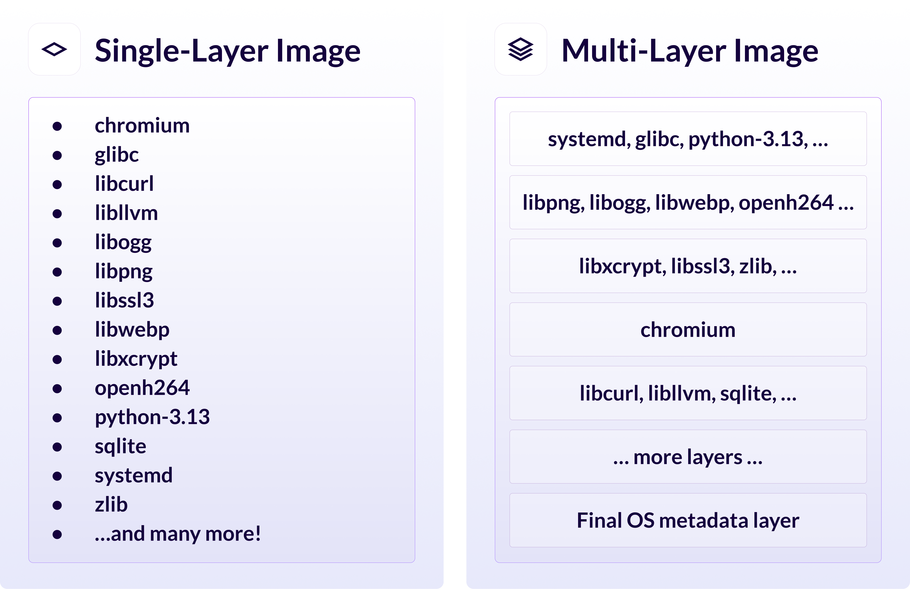

*Original URL: https://www.chainguard.dev/unchained/faster-pulls-smarter-builds-introducing-multi-layer-chainguard-containers*

---

# Faster Pulls, Smarter Builds: Introducing Multi-Layer Chainguard Containers

*Kim Lewandowski, CPO &amp; Co-founder, and Jason Hall*

*May 28, 2025*

One of Chainguard’s guiding values is customer obsession – we’re obsessed with building the most secure, minimal artifacts that power our customers’ applications and simplify how they manage open source software.

But security and minimalism shouldn't come at the cost of efficiency. Pulling large container images, especially complex ones for AI/ML workloads, can be time-consuming and bandwidth-intensive, particularly when only small parts of the image change frequently.

Today, we're excited to announce a significant enhancement to Chainguard [Containers](https://www.chainguard.dev/containers) that directly addresses this challenge:**multi-layer container images with intelligent rebuilds**. With Chainguard’s intelligent layers, customers should see faster pull times and increased bandwidth and storage efficiency. Ultimately, that means faster builds, tests, and deployments for your services, all of which speed up overall engineering velocity for your development teams.

Read on to learn more why we made this change, the technical details, and the benefits our customers can expect to see.

## Moving from a Single Slab to Intelligent Layers

Historically, [Chainguard Containers](https://www.chainguard.dev/containers) built with our `apko` tool](https://edu.chainguard.dev/open-source/build-tools/apko/getting-started-with-apko/) have utilized a single-layer approach. Our guiding philosophy was to offer simplicity and clarity, ensuring the entire filesystem was contained in one verifiable unit. Since `apko` builds images declaratively, adding a set of packages all at once, there was no immediate need for traditional layering techniques you'd find when building images with Dockerfiles.

However, as our image [catalog](https://images.chainguard.dev/) grew to over 1,300 images, many of which are large, complex, third-party applications like Py Torch and TensorFlow, we started to feel the limitations of this approach in our environment. And we weren’t alone – our customers noticed it too!

A single layer container image means that *any* update, no matter how small, requires users to download the entire image again. This impacts pull times, bandwidth usage, and overall developer velocity. With open source maintainers constantly updating packages to push out the latest features, security updates, and performance optimizations, these challenges compound.

We knew Chainguard could do better to deliver stability, security, and efficiency for our customers’ open source software. Container images are fundamentally designed around the concept of layers with distinct parts of the filesystem packaged as individual archives. Container runtimes cleverly use these layers for caching and deduplication. If multiple images share the same set of layers, you only store and download them once.

By adopting a multi-layer strategy, we can ensure that when you update a Chainguard Container, you only need to pull the*specific layers that contain changes *instead* of the whole image. Of course, deciding where and how to split the single layer into smaller, intelligent layers was a challenge. Luckily, our engineering team loves a challenge!

## Our Solution: Intelligent Layering for apko

Adopting layers for `apko`-built images wasn't as simple as mimicking traditional Dockerfiles, where each command often creates a new layer.` apko`constructs images based on declarative configurations, resolving dependencies and assembling the filesystem directly to ensure that packages contain files that are guaranteed not to overlap. We needed a strategy that preserved these optimizations while also maximizing the benefits of layering.

We started by simulating different layering strategies across our entire image catalog. Specifically, we analyzed partitioning images based on individual packages (APKs) versus grouping packages by their source or "origin" (packages built together often change together).

Because container runtimes have a hard limit on the number of layers in an image, and because many of our images are intended to be used as base images for other applications, we had to balance optimal efficiency with image compactness. It simply wasn't feasible to put only one package in each layer.

We ultimately decided on a "per-origin" strategy, where packages that derive from the same upstream source and therefore tend to receive updates together, are grouped into the same layer.

The results were compelling to say the least. In our testing, we allocated a modest budget of 10 layers and immediately observed the following:

- **~70% reduction**in the total size of unique layer data across our image catalog compared to the single-layer approach.

- **70-85% reduction**[in the cumulative bytes transferred when simulating sequential pulls of updated images [ikepytorch](https://images.chainguard.dev/directory/image/pytorch/versions) a [dnemo](https://images.chainguard.dev/directory/image/nemo/versions)

To maximize the stability and re-useability of our layers we identified, analyzed, and implemented three addition technical changes:

- Added in additional final layer that captures frequently updated OS-level metadata

- Developed intelligent layer ordering to optimize compatibility

- Ensured sufficient layer counts to optimize parallel downloads by container clients

As an example, let'[s take a closer look at our [Chromium](https://images.chainguard.dev/directory/image/chromium/versions) image, which currently contains 170 packages and weighs in at around 400MB:

The main benefit to this layered approach is that when one package changes, for example,**sqlite**, only that layer is affected, and all the other layers don't need to be re-downloaded. For customers who deploy thousands of services built on Chainguard Containers and consistently rebuild, refresh, and redeploy their applications, this optimization makes a huge difference for efficiency.

## What Multi-Layer Images Mean for You

Moving to multi-layered container images translates directly to tangible benefits for our customers. You should expect pulling layer images to be *significantly* faster, bandwidth efficient, and storage-efficient, leading to faster builds, tests, and deployments for your services.

Best of all, customers don't need to change anything about how they pull or use Chainguard Containers. The benefits happen automatically behind the scenes. You might simply notice that updates feel much quicker.

## Rollout and The Future

Multi-layer images have been rolled out across all Chainguard Containers as of today. This initiative represents our commitment to continuous improvement, listening to customer needs, and applying thoughtful engineering to enhance the security *and* efficiency of the software supply chain. We're excited for you to experience the benefits of faster, smarter Chainguard Containers. Discover Chainguard Containers [oday](https://www.chainguard.dev/contact), and stay tuned for further updates!
Share
