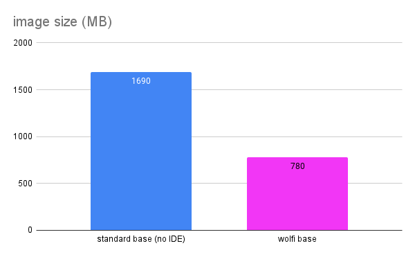

*Original URL: https://www.chainguard.dev/unchained/wolfi-at-work-minimal-developer-workstations-in-the-cloud*

# Wolfi at work: Minimal developer workstations in the cloud

Jason Hall May 29, 2024

At Chainguard, we think security extends far beyond just what's running in production. Our core engineering principles of [minimalism](https://www.chainguard.dev/unchained/the-principle-of-minimalism?utm_source=blog&utm_medium=website&utm_campaign=FY25-EC-Blog_sourced),[ephemerality](https://www.chainguard.dev/unchained/the-principle-of-ephemerality?utm_source=blog&utm_medium=website&utm_campaign=FY25-EC-Blog_sourced)and rapid updates provide meaningful security benefits to applications running in production and to CI/CD pipelines. Taking it even further, we recently began rolling out minimal Wolfi-based cloud workstations to our own developers to bring these benefits even further left in the software development lifecycle.


We started with the goal of providing a standard development environment for engineers packaging software for [Wolfi](https://www.chainguard.dev/unchained/get-em-while-theyre-hot-how-and-why-wolfi-releases-are-so-fast?utm_source=blog&utm_medium=website&utm_campaign=FY25-EC-Blog_sourced)— a super fast, lightweight, and secure Linux distribution configured identically for all developers building packages and images to reduce "works on my machine" bugs.


From the beginning, we knew that this would also be a great opportunity to "eat our own dogfood" if we built it with Wolfi packages. As we built out the solution further, we realized that by applying all of our security principles we were building something really powerful: an always-up-to-date, standard, auditable, minimal, ephemeral development environment in the cloud.


We started by building on top of Google's [Cloud Workstations](https://cloud.google.com/workstations?hl=en)product, which lets users specify a container image, which it then manages along with the underlying resources. Cloud Workstations also lets users specify a timeout after which it will stop the workstation, which is great for enforcing ephemerality and as a cost-saving measure.


This also let us ensure workstations always have up-to-date software, since on its next reboot it would have the latest built image. Automation rebuilds the workstation image using [Apko](https://github.com/chainguard-dev/apko) and pushes updated images every two hours, signed and attested with SBOMs, obviously. This means that when a developer starts their workstation in the morning, they have the latest-and-greatest, most up-to-date packages available in Wolfi. Workstations automatically stop after 12 hours maximum, to pick up the latest packages.


Workstations cold-start in under a minute — not even long enough to make a cup of coffee — and if they're already started, they connect in seconds. Once started, users can connect over SSH directly, or establish a local TCP tunnel and use Visual Studio Code using [Remote SSH](https://code.visualstudio.com/docs/remote/ssh).


Everything is managed entirely in Terraform — adding and removing users, updating workstations resources, adding and removing packages, everything – so changing any of that just requires a pull request to change it, and changes are deployed immediately, and available to users the next time their workstation starts.


Because the workstations are just regular Google Compute Engine (GCE) VMs, we can audit access and monitor usage using standard GCP controls, and easily destroy instances and disks when offboarding an employee.


Because we can tightly control what gets installed, and only install what we know we'll need, the Wolfi-based workstation image is a little less than half the size of the standard base workstation image:



780 MB is*pretty large*for a Wolfi-based image, but even at that size — because it only consists of the most up-to-date Wolfi packages with all the usual proactive patches for known vulnerabilities — it *still contains zero CVEs!* 🤯

```
`$ grype us-central1-docker.pkg.dev/redacted@sha256:5fb4ba1a651bae8057ec6b5cdafc93fa7e0b7d944d6f02a4b751de4e15464de
 ✔ Cataloged contents
 ├── ✔ Packages [3,258 packages]
 ├── ✔ File digests [40,574 files]
 └── ✔ File metadata [40,574 locations]
 ✔ Scanned for vulnerabilities [0 vulnerability matches]
 ├── by severity: 0 critical, 0 high, 0 medium, 0 low, 0 negligible
 └── by status: 0 fixed, 0 not-fixed, 0 ignored`
```


If you have a problem with bloated, insecure, out-of-date development environments —[let us know](https://www.chainguard.dev/contact?utm_source=blog&utm_medium=website&utm_campaign=FY25-EC-Blog_sourced)— we'd love to hear from you!
